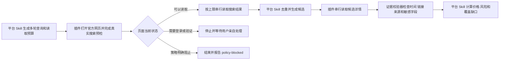

# AIALRA Shopping Browser

这是购物研究 Skill 共用的本地浏览器插件

它启动一个独立、可见、由用户管理登录状态的 Chrome，并把浏览器操作作为 MCP 工具提供给 Agent

MCP 是 Agent 调用外部工具的标准接口，本插件通过 MCP 提供打开页面、读取页面结构、点击只读控件、输入搜索词、等待页面和截图等能力

## 它解决什么问题

平台专用 Skill 擅长制定搜索轮次、验证商品身份、计算到手成本和判断风险

这些 Skill 仍然需要一个能够真实打开官方网页并保留登录状态的浏览器

本插件提供这一层共用能力，所以淘宝、闲鱼、京东、拼多多、eBay、Amazon、Walmart、小红书、知乎、大众点评和美团等 Skill 不必分别维护浏览器核心

## 安装后会出现什么

安装插件后，Codex 会得到名为 `aialra-shopping-browser` 的 MCP 服务

第一次调用浏览器工具时会打开一个新的 Chrome 窗口

这个窗口使用独立资料目录，不会读取你日常 Chrome 的标签页、扩展、历史记录或密码库

你在这个独立窗口里亲自登录网站，登录状态会保存在本机仓库外，下一次启动可以继续使用

插件仓库只保存代码和规则，不保存任何登录数据

## 安装

### 从个人插件市场安装

```bash
codex plugin marketplace add personal --path "$HOME/.agents/plugins/marketplace.json"
codex plugin add aialra-shopping-browser@personal
```

安装完成后新建一个 Codex 任务，新任务才能加载新增的 MCP 工具和 Skill

### 从源码验证

```bash
npm run validate
npm run test:mcp
```

`npm run validate` 检查插件清单、MCP 配置、证据校验器、敏感信息规则和单元测试

`npm run test:mcp` 会启动本地测试网页和临时 Chrome 资料，验证 MCP 能打开页面并读取可见内容

测试不会访问真实购物网站，也不会使用正式登录资料

## 第一次使用

1. 在新任务中要求检查 `aialra-shopping-browser` 是否可用
2. Agent 打开目标网站
3. 网站要求登录、扫码或验证码时，Agent 停止自动操作
4. 你在独立 Chrome 窗口完成操作
5. 你确认完成后，Agent从当前页面继续只读研究

## 默认本地目录

| 内容 | macOS 默认位置 | 用途 |
|---|---|---|
| Chrome 资料 | `~/Library/Application Support/AIALRA Shopping Browser/Profile` | 保存用户亲自建立的登录状态和站点设置 |
| 临时输出 | `~/Library/Caches/AIALRA Shopping Browser/MCP` | 保存运行时产生的临时截图或下载；页面结构快照只通过工具响应返回 |

这两个目录都位于 Git 仓库外

可以通过 `AIALRA_SHOPPING_BROWSER_PROFILE_DIR` 和 `AIALRA_SHOPPING_BROWSER_OUTPUT_DIR` 修改位置

环境变量只应填写本地目录路径，不能填写 Cookie、密码或令牌

## 一次研究怎样执行



## 稳定性原则

- 每次运行只使用一个浏览器资料和一个页面序列
- 平台搜索与详情默认串行执行
- 相邻自动动作至少间隔三秒
- 登录、人机检查、限流和策略阻止出现后不自动重试
- 同一运行优先复用已经取得的页面证据
- 页面改版时优先依靠可访问结构和可见文字，固定选择器只作为经过测试的辅助规则
- 搜索卡片用于发现候选，最终推荐必须经过详情页核验
- `about:blank` 只按页面丢失处理；允许在同一标签恢复当前官方入口一次
- 原始页面结构不写入插件目录或运行目录，结构化证据保存前必须清除临时参数

## 明确不做什么

- 不自动下单或产生账户写入
- 不读取或导出 Cookie、密码、本地存储和浏览器历史
- 不自动解决验证码或人机验证
- 不承诺绕过平台风控
- 不把搜索引擎摘要、第三方价格或模型记忆当作平台直接证据
- 不保证任何网站永远可访问，平台、网络和宿主策略都可能改变

## 文档入口

- [架构说明](docs/architecture.md) 解释每个组件怎样配合
- [使用与故障处理](docs/operations.md) 解释安装、登录、暂停和恢复
- [证据协议](docs/evidence-contract.md) 解释 Agent 必须交付什么 JSON
- [第三方审计](docs/third-party-audit.md) 记录采用与拒绝的开源方案
- [安全说明](SECURITY.md) 解释本地数据和权限边界
