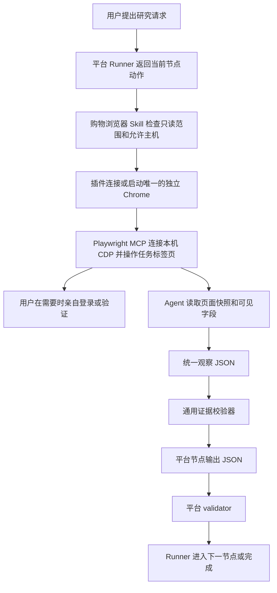

# 架构说明

## 一句话理解

平台 Skill 决定查什么和怎样判断，本插件负责在独立 Chrome 中读取当前网页证据

## 五个组件

| 组件 | 是什么 | 有什么用 | 谁操作 |
|---|---|---|---|
| 平台 Skill | 淘宝、闲鱼、eBay 或其他平台的专用工作流 | 生成查询、限定预算、核验字段、判断风险并排序 | Agent 按 Runner 执行 |
| Runner | 平台 Skill 中保存顺序和状态的程序 | 防止跳步、超量读取、绕过校验或提前宣布完成 | Agent 只调用命令 |
| AIALRA Shopping Browser Skill | 本插件中的浏览器执行说明 | 把 Runner 动作安全地映射到 MCP 工具 | Agent |
| Chrome 单例启动器 | 本插件中的本地启动程序 | 确保独立资料只由一个 Chrome 进程使用，并提供本机连接地址 | 插件自动管理 |
| Playwright MCP | 微软维护的浏览器工具服务 | 连接共享 Chrome 并提供导航、快照、点击、输入和截图 | Codex 自动启动 |
| 独立 Chrome 资料 | 仓库外的本地浏览器目录 | 保存用户亲自建立的登录状态，与日常 Chrome 隔离 | 用户完成登录 |

## 数据怎样流动

## 为什么使用独立 Chrome 资料

日常 Chrome 可能包含邮箱、企业后台、密码管理器和其他与购物研究无关的敏感状态

独立资料只保存研究网站的登录和站点设置

Agent 不需要读取 Cookie，也不需要控制用户日常标签页

用户可以通过删除独立资料目录一次性清除全部登录状态

## 多个任务怎样共用浏览器

第一个任务启动唯一的独立 Chrome，并把随机 CDP 端口只绑定到 `127.0.0.1`

后续任务读取资料目录中的 `DevToolsActivePort`，健康检查通过后连接同一个 Chrome

每个任务在首次访问时创建自己的标签页，并在该标签页中完成搜索和详情序列

任务不能关闭或改写其他任务的标签页

CDP 端口不绑定局域网或公网；本机用户权限和资料目录权限构成访问边界

## 为什么采用官方 Playwright MCP

它有明确的 Apache-2.0 许可证、持续维护、标准 MCP 接口、持久资料支持和可见浏览器支持

插件固定依赖版本，升级需要测试

本仓库不复制其代码，只通过启动器按固定参数运行

## 平台适配放在哪里

查询变体、商品稳定编号、链接规范化、价格字段、评价字段和风险阈值都放在平台专用 Skill

这些规则变化速度和含义不同，放进通用插件会导致平台互相污染

通用插件只定义页面状态、证据来源、时间、允许主机、只读边界和敏感字段规则

## 稳定性来自哪里

- 官方浏览器核心减少自建协议故障
- 固定版本避免依赖自动漂移
- 独立持久资料减少重复登录
- 单例 Chrome 和本机 CDP 连接消除多任务资料占用冲突
- 每个客户端使用独立私有临时目录，结束时清除底层日志、错误页、截图和下载
- 页面可访问结构减少固定选择器失效
- 单页面串行和有界预算减少请求压力
- 人工验证交接避免自动处理挑战
- 两层 Schema 和 validator 防止字段猜测
- 本地冒烟测试验证真实 MCP 启动和页面读取
